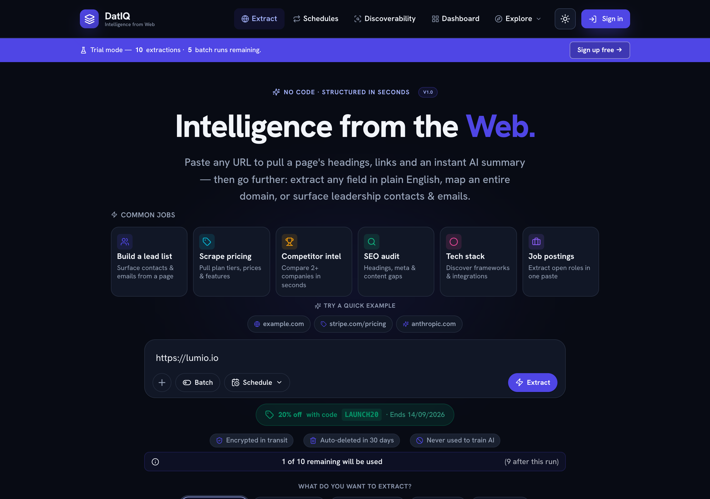
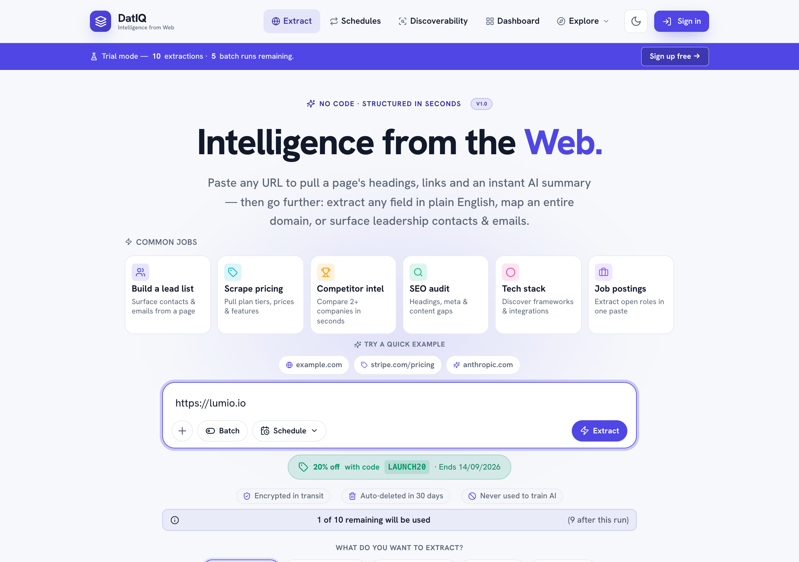
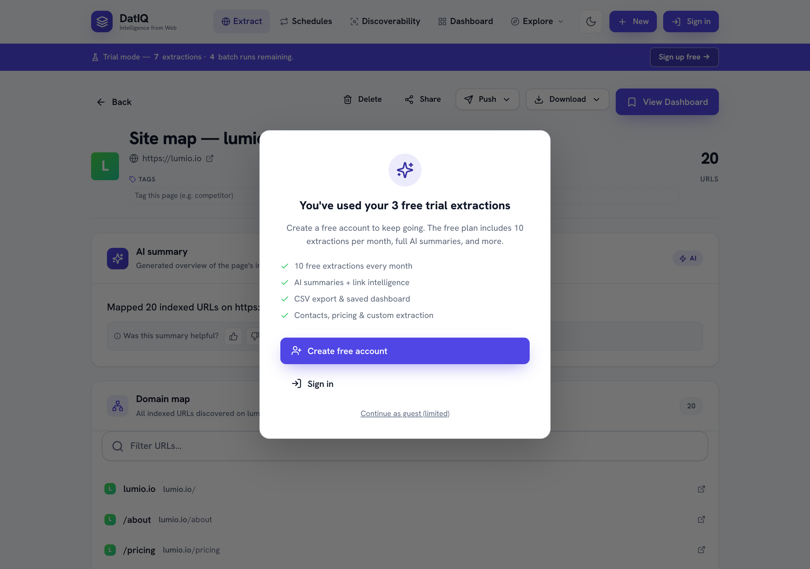
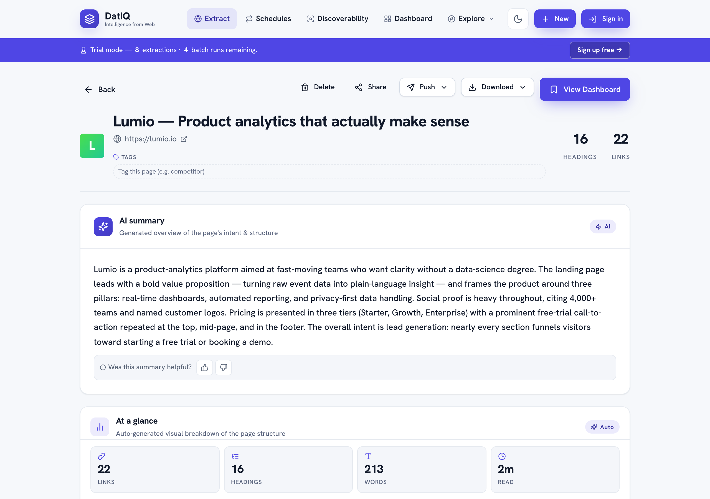
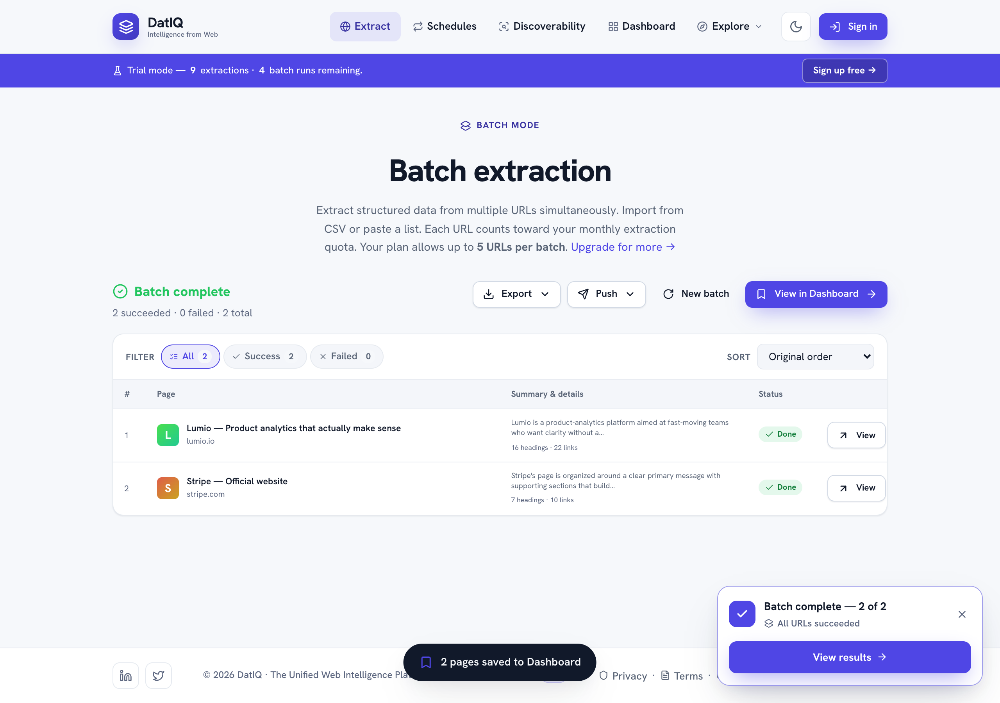
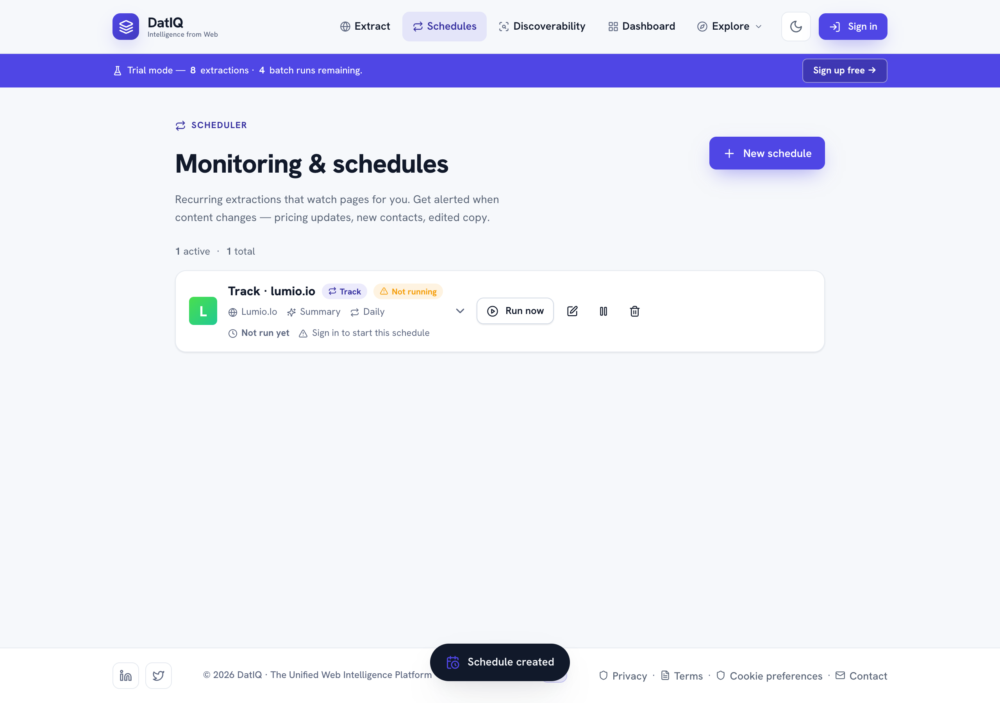
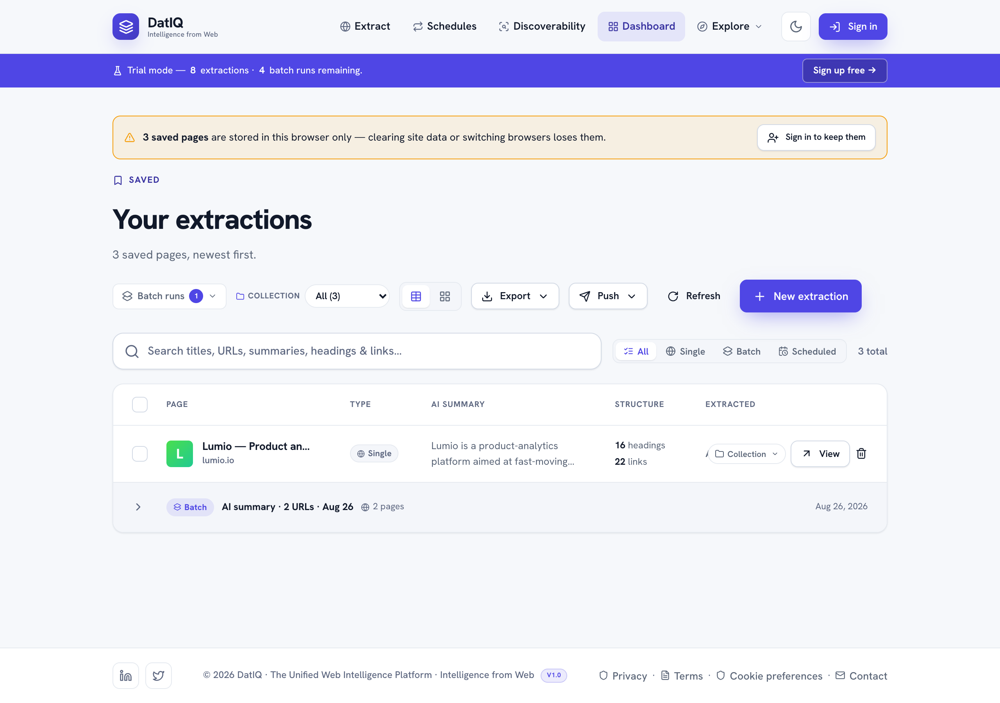
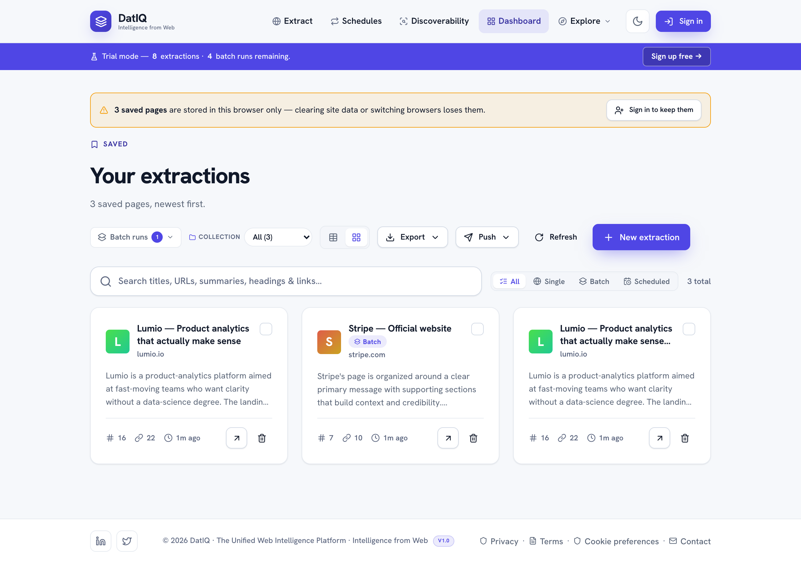
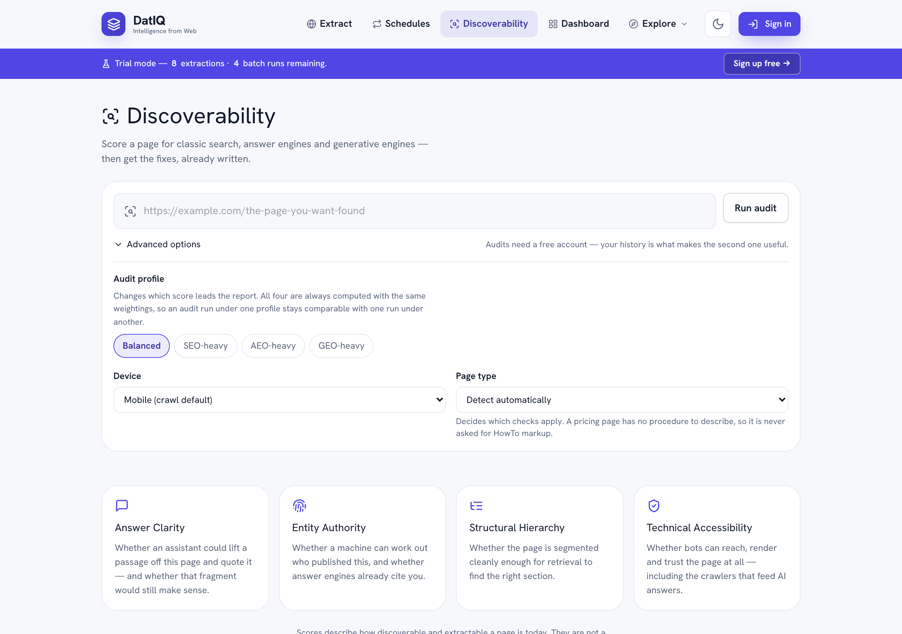
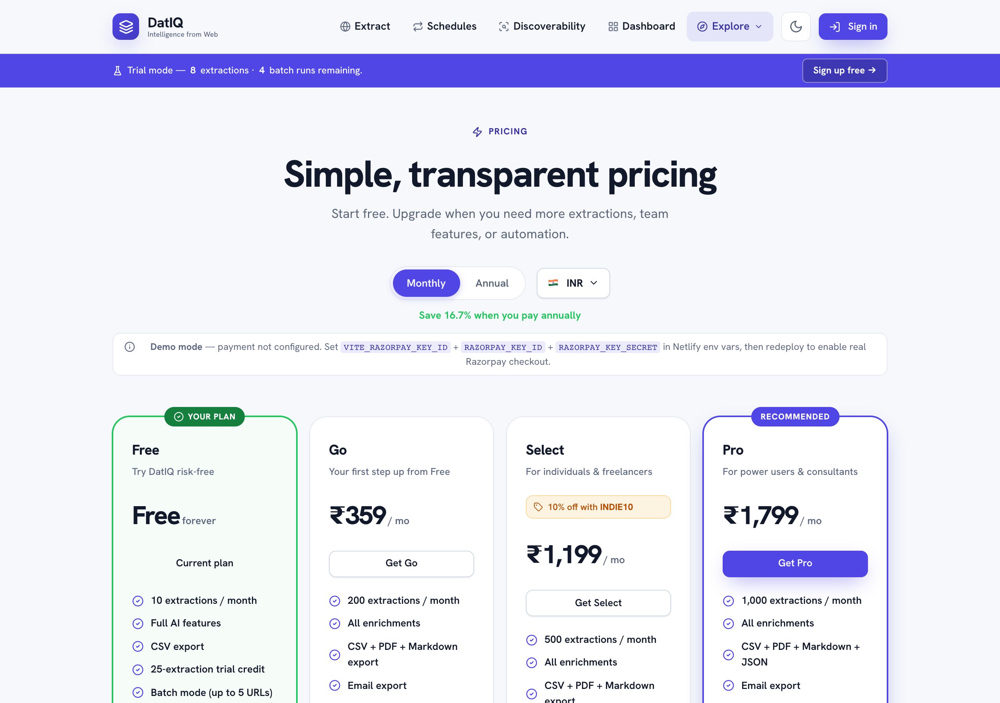

# DatIQ — User Guide & Help

> **Audience:** everyone who uses DatIQ — analysts, marketers, founders, researchers, and sales teams.
> This guide explains *what DatIQ does and how to use it*. It is written for people, not engineers:
> there are no code samples, database details, or setup instructions here. If you build software and
> want to call DatIQ programmatically, see the separate **[Developer API reference](developers.html)**.

DatIQ turns any public web page into structured, usable data — headings, links, contacts, pricing,
and a plain-language AI summary — in seconds. No code, no browser extensions, no scrapers to configure.
Paste a URL (or many), choose what you want, and DatIQ does the rest.

### Table of contents

1. What DatIQ is
2. Quick start — your first extraction
3. The Home composer
4. What you can extract
5. Reviewing results — the Preview screen
6. Enrichment & content generation
7. Batch extraction
8. Scheduling & change monitoring
9. Your Dashboard
10. Exports & sharing
11. Discoverability — SEO, AEO & GEO audits
12. Plans, usage & billing
13. Accounts, trial & sign-in
14. Privacy & your data
15. FAQ & troubleshooting
16. Keyboard shortcuts
17. Glossary

---

## 1. What DatIQ is

DatIQ is **The Unified Web Intelligence Platform** — a zero-code web-extraction and enrichment platform
organised as a stack of named pillars. Its foundation, **Pillar 0 — Web Intelligence (Core)**, is the
proven single, batch, and scheduled URL-extraction engine that the rest of the platform is built on.
Its promise is simple: **Intelligence from Web.** Give it a web address and it returns clean, structured
information you can read, filter, enrich, export, or monitor over time.

Typical things people pull out of a page:

- **Structure** — the full heading outline (H1–H6) and every link, internal and external, de-duplicated.
- **An AI summary** — a short, plain-language overview of what the page is about.
- **Contacts** — leadership names, role titles, and contact emails where a page exposes them.
- **Pricing** — structured pricing tiers and plan details from a pricing page.
- **A site map** — the set of indexed URLs across a whole domain.
- **Anything else** — describe a field in plain English ("founding year", "office locations") and DatIQ extracts it.

DatIQ works in light and dark themes; use the sun/moon button in the top bar to switch. Your preference is remembered.

### The pillars

DatIQ is organised as a stack of named pillars. **Pillar 0 is the foundation**; everything else is
layered on top of it.

| Pillar | Name | What it is |
|---|---|---|
| **P0** | **Web Intelligence (Core)** | The single, batch, and scheduled URL-extraction engine — proven, ships today. |
| P1 | Enrichment & Insight | AI summaries, contact enrichment, content generation (SEO briefs, competitor briefs). |
| P2 | Distribution & Workflow | CSV / PDF / Google Sheets export, scheduling, webhook push, CRM sync. |
| P3 | Workspace & Collaboration | *(roadmap)* shared workspaces, role-based access, team controls. |
| P4 | Intelligence Mesh (API) | *(roadmap)* REST + webhook API and native integrations. |

> Pillar 0 is what runs the moment you click **Extract** on the Home screen — whether that is one URL, a
> pasted list that becomes a **batch**, or a **schedule** firing later on. It is the engine; the rest of
> DatIQ is everything you can do once the engine has the data.

---

## 2. Quick start — your first extraction

1. Open DatIQ. You land on the **Home** screen with the composer in the middle.
2. Paste a URL into the box (for example, a company's home page or pricing page).
3. Pick **what you want to extract** using the intent chips below the box — start with **AI summary**.
4. Click **Extract**.
5. In a few seconds you're taken to the **Preview** screen with the results, and the page is saved to your **Dashboard** automatically.

That's the whole loop: **paste → choose → extract → review.** Everything else in this guide builds on it.

---

## 3. The Home composer

The composer is the single box at the centre of the Home screen. It adapts to what you type and which
toolbar options you pick, so one box handles single pages, many pages, and recurring jobs.

The composer is the **only place you start an extraction** — single page, many pages, or recurring. There is
no separate "Batch" screen to go to first; paste what you have and DatIQ works out what it is.

**The input box** accepts:

- **A single URL** → a normal one-page extraction.
- **Several URLs** (pasted as a list, one per line) → DatIQ recognises them and runs a **batch**.
- **Text that happens to contain links** — an email, a Slack thread, a Markdown list — → DatIQ counts the
  links and **asks which you meant**: *"Extract all 8"* or *"Extract this text as one page"*. Both are
  reasonable readings of a newsletter with ten links in it, so DatIQ never guesses for you.
- **Pasted text or page content** → DatIQ can structure and summarise raw text you paste in, even without a URL.

**The toolbar (bottom of the box):**

- **＋** — the options menu: **Import CSV** (upload a list of URLs), **Add multiple URLs** (switch the box to
  a multi-line list), and **Run in background** (see below). A dot on the ＋ means background mode is on.
- **Batch** — force batch mode for multiple URLs.
- **Schedule** — arm a recurring cadence (e.g. *Daily*) so the extraction repeats automatically. Choose **Custom schedule…** to open the full scheduling screen.
- **Extract** — the action button. Its icon reflects the mode: a single page, a batch (layers), or a scheduled run (calendar).

You can also **drag and drop a CSV file** anywhere onto the box to load a list of URLs.

### Run in background

Turn on **Run in background** in the ＋ menu and a run keeps going while you carry on working — browse your
Dashboard, start reading another page, or move around the app; the run is not tied to the screen you started
it from. Progress appears in a small **dock** in the corner showing `Extracting 3 / 12 URLs…`, the URL being
read right now, and a **Cancel** button. The setting is remembered between visits and applies to single and
batch runs alike.

> **Tip:** the quick-example chips above the box ("SaaS pricing page", "Company about page", "Blog / content")
> fill the box with a sample so you can try DatIQ instantly.

---

## 4. What you can extract

Below the input box is **"What do you want to extract?"** with a row of **intent chips**. Pick one before you extract:

| Intent | What you get |
|---|---|
| **AI summary** | A plain-language overview of the page, plus its heading outline and links. |
| **Find contacts** | Leadership names, role titles, and any contact emails the page exposes. |
| **Scrape pricing** | Structured pricing tiers and plan details from a pricing page. |
| **Map site** | A list of indexed URLs across the whole domain — useful for SEO and site audits. |
| **Custom…** | Describe any field in plain English and DatIQ extracts just that. |

**Advanced options** (the link under the chips) let you fine-tune a run. These apply to single **and** batch
runs, so a setting you pick here survives when DatIQ routes a multi-URL paste into a batch:

- **Render JavaScript** — waits a few seconds for React/Vue/Angular pages to finish drawing before reading them.
  Use it when a page looks empty in the results but fine in your browser.
- **Generate AI content for each URL** — drafts content per result as the run goes (adds roughly 1–2 s per URL).
  Pick the **content type** — *SEO blog outline*, *competitor summary*, or *social posts* — from the chips that
  appear. Not available in **Map site** mode.

When you import a CSV, DatIQ also shows **which column it detected the URLs in**, so you can confirm it picked
the right one before running.

When you choose **Map site**, the Preview shows the discovered URLs grouped for easy scanning:

---

## 5. Reviewing results — the Preview screen

After an extraction you land on **Preview**. This is where you read, verify, and act on a single page's results.

What you'll see:

- **Page header** — the page title, its URL, and counts of headings and links found.
- **AI summary** — the generated overview of the page's intent and structure.
- **Quick enrichment & content** — one-click buttons to pull more out of the page (contacts, leadership, social links, company mission, pricing) and a **Generate content** button.
- **Headings** — the full H1–H6 outline, in order.
- **Links** — every link found, automatically tagged **internal / external / social**, with filters so you can focus.

**Action bar (top):**

- **View Dashboard** — go to your saved archive (the page is already saved).
- **Download ▾** — export this page as CSV, PDF, Markdown, or JSON.
- **Delete** — remove this extraction.

---

## 6. Enrichment & content generation

Enrichment digs deeper into a page you've already extracted, and content generation turns a page into ready-to-use copy.

**Enrichment** (from the Preview's *Quick enrichment* card): click any focus — **Find contacts**,
**Leadership & board**, **Social links**, **Company mission**, or **Pricing & plans** — and DatIQ runs a
targeted pass and adds the result as its own tab. Enrichment runs quietly in the background; it never
interrupts what you're reading.

**Content generation** (the **Generate content** button on Preview, or on the Dashboard when pages are
selected): choose a format and DatIQ drafts it from the page:

- **SEO blog outline** — a ready-to-write structure with H2/H3 sections.
- **Competitor summary** — a concise competitive brief on the page's company.
- **Social posts** — a few short promotional posts for social channels.

Copy the result and use it anywhere.

---

## 7. Batch extraction

When you need many pages at once, use **Batch**. You start it exactly the same way you start anything else —
**from the Home composer**. Paste several URLs (or import a CSV, or turn on **Batch** in the toolbar) and
DatIQ runs them as a batch and takes you to the batch screen. There is no separate Batch tab in the
navigation; **Extract** covers it.

How it works:

1. **Paste URLs** (one per line) into the Home composer, or **Import CSV**, or drag a CSV onto the box.
2. Choose an **intent** (the same chips as single extraction), and any **Advanced options** you want.
3. Click **Extract**.
4. Watch progress in the **dock** — `Extracting 3 / 12 URLs…` with the current URL and a **Cancel** button.
   With **Run in background** on, you can leave the page and the run continues.
5. When it finishes you get a **results table** — each row shows the page, a summary snippet, and a status.
   **Filter** by *All / Success / Failed* and **sort** the rows; each failed URL shows its reason and a
   **Retry** button.
6. All successful pages are **saved to your Dashboard automatically**, and grouped together as one batch run.
7. **Export ▾** the whole batch (CSV, PDF, Markdown, JSON), **Push** it to a connected destination, start a
   **New batch**, or **View in Dashboard**.

### Coming back to a batch later

Every batch run gets its **own address**. The results page is `datiq.app/batch?run=<id>`, so you can bookmark
it, reload it, or share it with yourself and the full results — **including the failures** — come back exactly
as they were, with Retry still working.

That matters because only *successful* pages become Dashboard entries. A URL that failed has no Dashboard row
at all, so the batch results page is the only place its failure and its Retry button live. Your Dashboard also
links back here from a run's banner when that run had failures.

> **Note:** each URL in a batch counts toward your monthly extraction allowance, and plans have a maximum
> number of URLs per batch. The page tells you your current limit.

---

## 8. Scheduling & change monitoring

Scheduling lets DatIQ **re-check a page on a recurring cadence and alert you when it changes** — perfect
for watching a competitor's pricing, a careers page, or any page that matters.

> **Scheduling needs an account.** Recurring runs happen on DatIQ's servers, not in your browser — so a
> schedule has to be saved to your account before anything can run it. If you create one while signed out,
> DatIQ **holds onto it and prompts you to sign in**, then saves it for you automatically the moment you do.
> Any schedule that could not be saved is clearly labelled **"Not running — sign in to start this schedule"**
> rather than showing you a next-run time it can't honour.

**Two ways to create a schedule:**

- **From Home** — pick a preset cadence (e.g. *Daily*) in the composer's **Schedule** menu, then Extract. This arms a recurring job for that URL (or batch).
- **From the Schedules screen** — click **New schedule** for the full editor.

**In the schedule editor you set:**

- The **URL** to watch and the **intent** (what to extract each time).
- A **cadence** — presets (Every 6 hours, Twice daily, Daily, Every weekday, Weekly, Monthly) or a **custom** builder (frequency · day · time).
- An optional **"run until" end date**.
- An optional **alert email** to notify when the page changes.
- A **name** so you can recognise it later.

**On the Schedules list**, each schedule shows its cadence, when it last ran, and when it runs next. For each one you can:

- **Run now** — check the page immediately and see whether it changed.
- **Edit**, **Pause / Resume**, or **Delete**.
- Expand it to see all its settings.

When an automated run detects a change, DatIQ records it and — if you set an alert email — sends you a notification.

**If your plan lapses,** scheduled runs pause automatically and resume on their own when you renew — you
do not have to re-create or re-arm them. A schedule you paused yourself stays paused either way. See
[Plans, usage & billing](#11-plans-usage--billing).

---

## 9. Your Dashboard

The **Dashboard** is your saved archive. Every extraction (single, batch, or scheduled) is saved here automatically.

Features:

- **Search** across your saved pages.
- **Type filter** — All / Single / Batch / Scheduled, with a chip on each row showing where it came from.
- **Grouping** — batch runs and scheduled runs collapse into a single parent row you can expand; single extractions stand alone.
- **Table or card view** — switch with the layout toggle.
- **Batch runs** — reopen any past run's full results, failures included.
- **Export ▾**, **Push ▾**, and **Refresh** sit together in the toolbar.

**Working with selections:** tick one or more rows and a selection row appears beside the filters with
**Generate** (content), **Email**, and a count you can **Clear**. **Export ▾** and **Push ▾** stay in the
toolbar and follow your selection: with rows ticked they act on those rows, and with nothing ticked they act
on everything currently filtered — so *"Export all 8"* and *"Push to (8)"* always agree. Each row also has
**View** (open in Preview) and **Delete**.

### Signed out? Your pages are saved in this browser only

You can extract without an account, and those pages are saved — but **only in the browser you used**. Clearing
site data or switching browsers loses them. The Dashboard says so plainly at the top, telling you how many
pages are browser-only. **Sign in and DatIQ moves them onto your account for you** — nothing to re-run and
nothing to re-import.

---

## 10. Exports & sharing

There are exactly **two** ways to get data out, and they do not overlap:

- **Export ▾** — **downloads and clipboard.** Files you save, or text you paste somewhere.
- **Push ▾** — **send it to another tool.** One button, one list of destinations.

Export is available from **Preview** (**Download ▾**), the **Dashboard** (**Export ▾**), and **Batch**
results (**Export ▾**). Push sits next to it in all three places.

| Format | Best for |
|---|---|
| **CSV** | Spreadsheets and importing into other tools. |
| **PDF** | A polished, shareable report. |
| **Markdown** | Pasting into docs, wikis, or notes. |
| **JSON** | Structured data for further processing. |
| **Email** | Send selected extractions straight from the Dashboard. |
| **Copy to clipboard** | Paste Markdown / JSON / CSV straight into a doc or chat. Available from the same Export menu. |

Some formats are available on higher plans — the export menu shows which.

### Push to your tools

**Push ▾** is the single place destinations live — from Preview, Dashboard, and Batch results. Everything you
can send to is in that one menu, so there is no second list to go hunting for.

| Destination | What you push | Setup |
|---|---|---|
| **HubSpot** | Contacts and companies from an extraction, mapped to the right HubSpot properties | Once, in `/account#integrations` |
| **Airtable** | Each extraction row into the table you choose, with a per-table field map | Once, in `/account#integrations` |
| **Notion** | Each extraction into a Notion database, with a title column and property mapping | Once, in `/account#integrations` |
| **Slack** | New extractions and change alerts into the channel you choose, formatted as a readable message | Once, in `/account#integrations` |
| **Google Sheets** | A CSV of the rows you picked, with a blank sheet opened ready to receive it | **No setup needed** |

Google Sheets is marked *"No setup needed"* in the menu because there is genuinely nothing to authorise —
DatIQ downloads the CSV and opens a fresh sheet for you to drop it into.

The four connected destinations are set up once in **Account → Integrations**; after that, pushing is a single
click and the destination receives the structured data directly — no copy-pasting, no CSV re-uploads. A
connected destination stays connected: **Test** it, **Edit** its label, or **Disconnect** it from the Account
screen. Tokens are stored server-side and never re-displayed; replacing a token re-fetches the schema where
that applies (Airtable / Notion).

Need to change an Airtable or Notion **field mapping**? Open **More destination options…** at the bottom of
the Push menu.

**Zapier** works differently and is not in the Push menu: it *listens* for new extractions as a trigger event
for any of 5,000+ apps, rather than being somewhere you push to. Set it up in `/account#integrations`.

### Sharing a single extraction

From any extraction on the Dashboard or Preview, click **Share** to get a public link. The link
opens a read-only report at `datiq.app/p/<short-code>` that anyone can view — no sign-in needed.
Public reports can be unshared at any time. Recent public extractions also surface on the
**`/gallery`** page.

---

## 11. Discoverability — SEO, AEO & GEO audits

Extraction answers *"what is on this page?"*. Discoverability answers a different
question about a page you usually already own: **"can this page be found, and
can an AI assistant quote it?"**

Open **Discoverability** in the top nav, paste a URL, and press **Run audit**.

### What it measures

Search has split into three audiences that reward different things, so DatIQ
scores all three separately and shows you where they disagree.

| Score | Audience | Rewards |
|---|---|---|
| **SEO** | Classic search engines | Crawlability, rendering, canonicals, page speed |
| **AEO** | Answer engines (ChatGPT, Perplexity, AI Overviews) | Concise, answer-first passages that survive being quoted |
| **GEO** | Generative engines | A clear machine-readable identity, and being cited as the source |
| **Overall** | All three, weighted | A balanced view when you are not optimising for one in particular |

Underneath those sit four pillars, and every score traces back to them:

- **Answer Clarity** — is there a self-contained answer near the top, and would it still make sense quoted on its own?
- **Entity Authority** — can a machine tell who published this, and do answer engines already cite you?
- **Structural Hierarchy** — is the page segmented cleanly enough for a retrieval system to find the right section?
- **Technical Accessibility** — can bots reach, render and trust the page at all, including the crawlers that feed AI answers?

Open any pillar card to see every individual signal, its weight, and its score.

### "Not measured" is not zero

Some signals need something outside the page — Core Web Vitals come from
Google's field data, and citation footprint comes from sampling an answer
engine. When one of those is unavailable, DatIQ marks it **not measured** and
leaves it out of the score entirely, redistributing its weight across the
signals it *could* read.

That is why every score shows a **coverage** figure beside it. A 92 built on 70%
of the signals is not the same as a 92 built on all of them, and you should be
able to see which one you are looking at.

Some signals are marked **not applicable** instead. A pricing page has no
step-by-step procedure, so it is never asked for HowTo markup, and it is not
marked down for the absence.

### Blocking issues

A few problems undermine a page no matter how good the writing is — the page is
marked `noindex`, AI crawlers are disallowed, the content only appears after
JavaScript runs. These scale the whole score down rather than costing it a few
points, and the report shows you the arithmetic: your score before the blockers,
the multiplier, and the result.

### The fix list

Every finding becomes a prioritised recommendation with:

- **who** does it — content, SEO, engineering, brand or product
- **how much** it is worth on *your* page, not in general
- **how hard** it is, and how confident we are the finding is right
- **something to paste**, where one exists

That last one is the point. Where a fix is a piece of markup or a block of copy,
DatIQ writes a draft from what your page already contains — FAQ schema built
from your visible questions, an Organization block carrying your real profile
links, a corrected heading outline that leaves your wording alone and fixes only
the nesting.

Anything the audit could not observe appears as a `TODO:` placeholder rather
than an invention. Fill those in before you publish — a schema block containing a
made-up founder name is worse than no schema block, because it tends to get
published without being read.

Sort the queue by owner, accept what you will do, and dismiss what does not
apply. A dismissal asks for a reason, because three months later a dismissal
with no reason is indistinguishable from a mis-click.

### Proving the fix worked

An audit is a reading. Two are a direction.

Press **Re-audit** after you have made changes and DatIQ measures the page again
and compares it against the previous run: what moved, what was resolved, and —
most importantly — anything **new** that appeared, because a fix that introduces
a regression is exactly what you want to catch before it compounds.

The comparison only reports a change when both audits actually measured the same
thing. If Core Web Vitals were unavailable last week and available today, that
difference is labelled as not comparable rather than being presented as your
improvement.

The **History** panel plots every audit of that page over time. A gap in the line
is a run where that score could not be measured — it is drawn as a gap rather
than a straight line, because joining two points through a reading that never
happened would show a trend you did not have.

### Watching a page

On Pro and above you can put a page on a schedule — daily, weekly or monthly.
DatIQ re-audits it in the background and emails you only when something material
moves: the overall score past a threshold you set, or a new critical issue.

A monitor that emails every week regardless is a monitor nobody reads by week
four, so it stays quiet when nothing has happened.

### Comparing against competitors

A **benchmark** audits several URLs with the same profile and lines the results
up side by side, so "why is that page more answer-ready than mine?" becomes a
question you can answer from evidence rather than intuition.

### Audit allowances

Audits have their own monthly allowance, separate from extraction credits — an
audit fetches the page twice, checks crawl policy, looks up performance data and
runs an AI pass, so it costs more than an extraction and gets its own budget.

| Plan | Audits / month |
|---|---|
| Free | 3 |
| Go | 10 |
| Select | 25 |
| Pro | 100 |
| Business | 500 |
| Agency | 2,000 |

Scheduled monitoring needs Pro or above. Benchmarks need Select or above.

### What it does not promise

Scores describe how discoverable and extractable your page is **today**. They
are not a prediction of rankings, citations or traffic, and no honest tool can
give you one. What they do give you is a reproducible measurement, the evidence
behind it, and a list of things to change — so that when the outcome does move,
you know what you changed.

### Sites that ask not to be read

DatIQ honours robots.txt. If a site's robots.txt disallows automated access,
the audit is refused rather than run.

If the site is yours, or you have the owner's permission, you can record that
once per site and re-run. That confirmation is tied to your account and to that
exact site, it expires after 180 days, and you can withdraw it at any time.

## 12. Plans, usage & billing

DatIQ offers a free tier plus paid plans for heavier use. Pricing is shown in your local currency where
supported, with monthly and annual billing (annual saves you money).

- **Free** — a monthly allowance of extractions, full core features, and a one-time bonus credit when you sign up.
- **Paid plans** (Go, Select, Pro, Business, Agency) — higher allowances, larger batches, more workspaces, and additional capabilities such as API access on Business and above.
- **Top-up bundles** — add extra batch capacity to your current plan without changing tiers.
- **Enterprise** — custom volume and terms; contact sales.

Manage everything from the **Account** screen: your current plan, usage this month, usage alerts,
coupon entry, and payment history. Before any charge, a confirmation shows the full breakdown (including taxes where applicable).

A detailed **plan comparison matrix** sits below the plan cards on the pricing page — it lists every
capability by tier so you can see at a glance which plan unlocks what.

### Invoices & receipts

Every completed payment produces its own numbered, itemised document, listed under **Invoices &
receipts** on the Account screen.

- **You get it automatically.** A copy is emailed to you as a PDF attachment as soon as the payment
  completes — you do not have to ask for it or download it to have a copy.
- **View, download, or re-send.** Open any document to see the full breakdown line by line, download
  the PDF again, or have it emailed to you a second time. Re-sending always goes to the address on
  your account, never to an address typed into the page.
- **Receipt or tax invoice.** Where DatIQ is registered for tax in your region, the document is a full
  tax invoice showing the tax split; elsewhere it is a payment receipt that states it is not a tax
  invoice. Either way the amounts reconcile exactly to what you were charged.
- **Documents are permanent records.** An issued document is never edited or re-numbered. If something
  needs correcting, a separate credit note is issued against it, so your records and ours always match.
- **They outlive the subscription.** Your billing documents stay available to you even if you cancel or
  your plan lapses.

### If a plan lapses

If a paid plan ends without renewing, the account moves through clearly-signposted stages rather than
disappearing:

1. **Suspended** — a banner explains the state. Your saved data is intact, and renewing restores full
   access immediately.
2. **Deactivated** — after a further period, if still unrenewed.

You are emailed at each stage, and again before anything is removed, so a lapse is never silent.
Scheduled monitoring **pauses** while a plan is lapsed and **resumes automatically** when you renew —
schedules you paused yourself stay paused. Renewing at any stage puts everything back.

---

## 13. Accounts, trial & sign-in

- **Try without an account** — you can start extracting straight away. A trial banner shows how many free
  single extractions and batch runs remain. DatIQ never interrupts you on arrival: the limit is checked
  **when you start a run**, so you are only ever stopped at the moment it actually applies.
- **Sign up / sign in** — create an account with email, or continue with Google, Microsoft, or GitHub. An
  account keeps your work and lifts trial limits.
- **What signing in gets you** — three things stop being temporary:
  - **Your saved pages move onto your account** automatically, instead of living in one browser.
  - **Schedules actually run.** Recurring runs happen on DatIQ's servers, so they need an account (see
    [Scheduling](#8-scheduling--change-monitoring)).
  - **Push destinations** become available.
- **Personas** — optionally tell DatIQ what kind of work you do, and it tailors examples and labels to you. This is opt-in and changeable any time.
- **Sign out** — clears your session data from the device.

---

## 14. Privacy & your data

- DatIQ extracts only from **publicly accessible** pages you point it at.
- Your saved extractions are tied to your account (or kept on your device when you use DatIQ without signing in).
- You can **delete** any extraction at any time from Preview or the Dashboard.
- Signing out clears your session data from the device.
- For full details, see the **Privacy Policy** and **Terms** linked in the footer. DatIQ's privacy practices
  include coverage for applicable data-protection regulations.

---

## 15. Troubleshooting

> Looking for general questions — pricing, plans, sharing, keyboard shortcuts, what DatIQ can
> extract? Those all live in one place now: **[the DatIQ FAQ](https://datiq.app/faq)**. This section
> covers only what to do when something has gone wrong.

**My extraction came back thin or empty.**
Some pages block automated access or load their content with heavy JavaScript. Try enabling JavaScript
rendering in **Advanced options**, or try a more specific page (e.g. the pricing page rather than the home page).

**The AI summary looks generic.**
Summaries reflect what the page actually exposes. Pages with little text, or that hide content behind
logins, give the model less to work with.

**"App updated — please refresh."**
DatIQ ships improvements regularly. If you've had a tab open for a while and an export or action shows
this message, just refresh the page and try again.

**A batch URL failed.**
The results table shows the reason next to each failed URL, with a **Retry** button on that row. Common
causes are unreachable sites, non-HTML pages, or sites that block automated requests. Other URLs in the
batch still succeed. Failures are kept with the run, so you can come back to
`datiq.app/batch?run=<id>` later and retry from there — a failed URL has no Dashboard entry, because only
successful pages are saved there.

**I navigated away and lost my run.**
You shouldn't any more. Turn on **Run in background** in the composer's **＋** menu and runs continue while
you move around the app, with progress in the corner dock. To find a finished run afterwards, open **Batch
runs** on the Dashboard.

**I pasted an email / document full of links and it extracted the whole thing as one page.**
That is one of the two things DatIQ can reasonably do with it, so it asks rather than guesses. Look for the
inline chooser under the box: **"Extract all N"** pulls the individual links; **"Extract this text as one
page"** treats the paste as a single document.

**My schedule says "Not running".**
It was created while signed out and could not be saved to your account, so no server has it to run. Sign in
and DatIQ saves it for you automatically.

**Nothing here matches my problem.**
Check [the FAQ](https://datiq.app/faq) for general questions about sharing, exports, scheduling
alerts, keyboard shortcuts and what each screen does. If it is still not covered,
[contact us](https://datiq.app/contact) and we will help.

---

## 16. Keyboard shortcuts

DatIQ has power-user shortcuts for fast navigation and common actions. Press <kbd>?</kbd> any time
to see the full list.

| Shortcut | Action |
|---|---|
| <kbd>?</kbd> | Show this help. |
| <kbd>Esc</kbd> | Close any open modal or overlay. |
| <kbd>/</kbd> | Focus the search / URL input. |
| <kbd>⌘K</kbd> (Mac) / <kbd>Ctrl+K</kbd> (Windows/Linux) | Open the command palette (jump anywhere). |
| <kbd>g</kbd> then <kbd>d</kbd> | Go to Dashboard. |
| <kbd>g</kbd> then <kbd>b</kbd> | Go to Batch. |
| <kbd>g</kbd> then <kbd>s</kbd> | Go to Schedules. |
| <kbd>g</kbd> then <kbd>p</kbd> | Go to Pricing. |
| <kbd>g</kbd> then <kbd>w</kbd> | Go to Workspace. |
| <kbd>g</kbd> then <kbd>t</kbd> | Replay the onboarding tour. |

---

## 17. Glossary

- **Extraction** — one run of DatIQ against a page, producing structured results.
- **Intent** — what you want from a page (summary, contacts, pricing, map, or custom).
- **Enrichment** — a targeted follow-up pass that adds more detail (e.g. contacts) to an extraction.
- **Batch** — extracting many URLs in one run.
- **Schedule** — a recurring extraction that watches a page and alerts you to changes.
- **Preview** — the screen where you review a single extraction.
- **Dashboard** — your saved archive of all extractions.
- **Content generation** — turning an extracted page into a draft (blog outline, competitor summary, or social posts).
- **Map site** — discovering the set of indexed URLs across a domain.
- **Top-up bundle** — extra capacity added to your current plan.
- **Outcome tile** — a pre-wired shortcut chip above the URL box (lead list, pricing, etc.).
- **Template** — a pre-built extraction recipe (YC companies, SaaS pricing, etc.) you can apply in one click.
- **Workspace** — your logged-in command center for recent extractions and activity.
- **Public report** — a read-only shareable link at `datiq.app/p/<short-code>`.
- **Provenance** — a label that tells you where each piece of extracted data came from.
- **Command palette** — press <kbd>mod</kbd>+<kbd>k</kbd> to jump anywhere.
