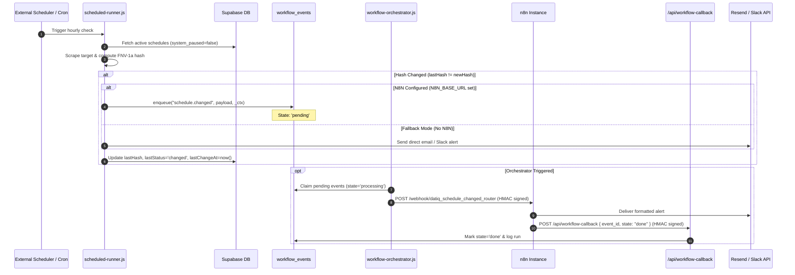
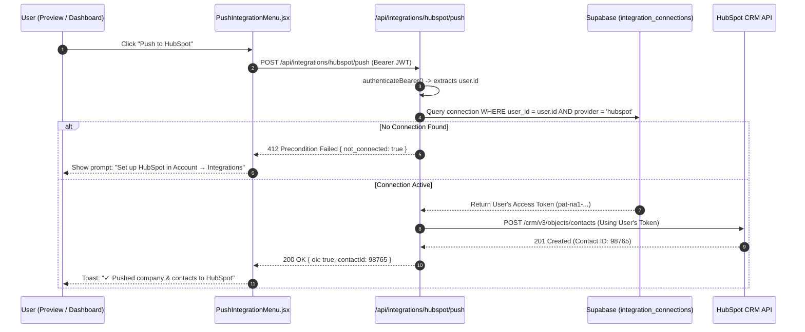

# DatIQ — Master Feature Architecture, Impact Analysis & n8n Workflow Implementation Plan

> **Document Type:** Master Feature Architecture, Impact Analysis, Orchestration & Verification Reference  
> **Target Branch:** `workflow-implementation-and-optimization`  
> **Status:** Implemented, Validated (10/10 Test Suites Green) & Pushed to `origin/workflow-implementation-and-optimization`  
> **Deployed n8n Target:** `https://n8n-dev-692109205619.asia-south1.run.app`  
> **Guiding Principle:** Enhance and decouple without altering or regressing existing, fully-functional customer features.

---

## Table of Contents
1. [Executive Summary & Impact Matrix](#1-executive-summary--impact-matrix)
2. [Deep Architectural Analysis & Strategic Decisions](#2-deep-architectural-analysis--strategic-decisions)
   - 2.1 [The 2-Phased n8n Rollout Strategy](#21-the-2-phased-n8n-rollout-strategy)
   - 2.2 [Decoupling n8n from Supabase: The "Server Callback API" Architecture](#22-decoupling-n8n-from-supabase-the-server-callback-api-architecture)
   - 2.3 [Resilient Fallback Mechanisms & 32-Bit Deduplication Locking](#23-resilient-fallback-mechanisms--32-bit-deduplication-locking)
   - 2.4 [Step-by-Step UI Guide: Creating & Binding Credentials in n8n Dashboard](#24-step-by-step-ui-guide-creating--binding-credentials-in-n8n-dashboard)
   - 2.5 [Third-Party Integration Mapping & Strict Multi-Tenant Isolation](#25-third-party-integration-mapping--strict-multi-tenant-isolation)
   - 2.6 [Platform-Agnostic Self-Hosted n8n Deployment Architectures](#26-platform-agnostic-self-hosted-n8n-deployment-architectures)
   - 2.7 [Zero-Hardcoding 3-Tier Parameter Abstraction Model](#27-zero-hardcoding-3-tier-parameter-abstraction-model)
3. [Comprehensive Feature Catalog: Existing vs Modified vs New](#3-comprehensive-feature-catalog-existing-vs-modified-vs-new)
   - 3.1 [Existing Untouched Functional Areas](#31-existing-untouched-functional-areas)
   - 3.2 [Modified & Enhanced Features](#32-modified--enhanced-features)
   - 3.3 [Newly Built Functionalities](#33-newly-built-functionalities)
4. [End-to-End Logical Flows & Sequence Diagrams](#4-end-to-end-logical-flows--sequence-diagrams)
5. [Automated Test Suite Verification Matrix (10/10 Suites Green)](#5-automated-test-suite-verification-matrix-1010-suites-green)
6. [Cross-Reference Directory to Subordinate Documentation](#6-cross-reference-directory-to-subordinate-documentation)

---

## 1. Executive Summary & Impact Matrix

The `workflow-implementation-and-optimization` branch introduces an enterprise-grade asynchronous orchestration pipeline while strictly preserving all existing, fully-tested customer features:

```
┌─────────────────────────────────────────────────────────────────────────────────────────────┐
│                                   DATIQ PLATFORM SCOPE                                      │
├──────────────────────────────┬──────────────────────────────┬───────────────────────────────┤
│    EXISTING & PRESERVED      │     MODIFIED & ENHANCED      │          NEWLY BUILT          │
│   (No Functional Changes)    │   (Additive / Backwards-OK)  │      (Enterprise Engine)      │
├──────────────────────────────┼──────────────────────────────┼───────────────────────────────┤
│ • Single-URL & Map Scraping  │ • Scheduled Alert Delivery   │ • Asynchronous Event Bus      │
│ • Custom Schema Extraction   │   (Queue + Direct Fallback)  │   (`workflow_events` queue)   │
│ • 5 Quick Enrichment Tabs    │ • Account Settings UI        │ • Server Callback API         │
│ • Batch Extraction & Retry   │   (Added Integrations Tab)   │   (`POST /api/workflow-cb`)   │
│ • Dashboard & Visualizations │ • Push Integrations Menu     │ • Orchestrator Polling Daemon │
│ • CSV/PDF/MD/JSON Exports    │   (Direct 1-click Push)      │ • HMAC Replay Protection      │
│ • Discoverability GEO/AEO    │ • Integrations Directory     │ • 17 Environment n8n Flows    │
│ • Auth, Billing & Lifecycle  │   (Honest Status Badges)     │ • 11 MCP Operations Tools     │
│ • Team Workspaces & Seats    │ • Admin Navigation           │ • Admin Automation Portal     │
│                              │   (Workflows Tab)            │   (`/admin/automation`)       │
└──────────────────────────────┴──────────────────────────────┴───────────────────────────────┘
```

---

## 2. Deep Architectural Analysis & Strategic Decisions

### 2.1 The 2-Phased n8n Rollout Strategy

To achieve maximum production stability without operational complexity:

| Phase | Architecture | Key Characteristics & Guarantees |
|---|---|---|
| **Phase 1: Initial Launch (Active)** | Single n8n instance at `https://n8n-dev-692109205619.asia-south1.run.app` with **Server Callback API** | Lowest cost, zero database credentials inside n8n, environment-isolated routing via `_ctx.callback_url`. |
| **Phase 2: Scale & Team** | Dedicated `staging-n8n` + `prod-n8n` instances | **100% Isolated**. Staging experiments never touch production queues. Workflows are tested on Staging and imported to Production via Git-tagged JSON files. |

---

### 2.2 Decoupling n8n from Supabase: The "Server Callback API" Architecture

> [!IMPORTANT]
> **Complete Decoupling Guarantee: Zero Master Database Keys in n8n.**  
> `datiq-supabase-service` (the master Supabase `service_role` key) has been completely removed from n8n. All database mutations are handled server-side by DatIQ.

```
               SERVER CALLBACK ARCHITECTURE & LIFECYCLE

 ┌───────────────────────────┐                 ┌───────────────────────────┐
 │       DATIQ SERVER        │                 │        n8n INSTANCE       │
 │   (Netlify Functions)     │                 │   (Orchestration Engine)  │
 └─────────────┬─────────────┘                 └─────────────┬─────────────┘
               │                                             │
               │ 1. Dispatch Event                           │
               │    Payload includes:                        │
               │    `_ctx.callback_url` & `event_id`         │
               ├────────────────────────────────────────────►│
               │    (Signed with HMAC-SHA256)                │
               │                                             │ 2. Execute Automation
               │                                             │    (Format Resend Email,
               │                                             │     Post to Slack, etc.)
               │                                             │
               │ 3. POST /api/workflow-callback              │
               │    Body: { event_id, state: "done" }        │
               │    Header: X-DatIQ-Signature                │
               │◄────────────────────────────────────────────┤
               │                                             │
 ┌─────────────┴─────────────┐                               │
 │ 4. Update Database:       │                               │
 │    Netlify uses ITS OWN   │                               │
 │    environment-scoped     │                               │
 │    SUPABASE_SERVICE_KEY   │                               │
 │    to update `events` row │                               │
 └───────────────────────────┘                               └─────────────────────────────┘
```

#### Key Benefits of the Server Callback Pattern:
1. **Zero Database Keys in n8n**: n8n **never** touches or stores the Supabase `service_role` key. It only requires the shared webhook HMAC secret (`N8N_WEBHOOK_SECRET`).
2. **Universal Environment Compatibility**: Because `_ctx.callback_url` points to the originating deployment (e.g. `staging--datiqapp.netlify.app` vs `datiq.app`), each environment handles its own database writes using its own local environment variables.
3. **Total Schema Decoupling**: Database schema alterations or migrations are encapsulated entirely within DatIQ server code.

---

### 2.3 Resilient Fallback Mechanisms & 32-Bit Deduplication Locking

> [!IMPORTANT]
> **Safety Guarantee: Immediate Fallback + Strict Duplicate Suppression.**  
> If n8n or the event orchestrator is unconfigured, unreachable, or experiencing downtime, every modified component will automatically execute its direct native fallback.

```
              SCHEDULED RUNNER DETECTION & DEDUPLICATION FLOW

               [ scheduled-runner.js (Hourly Cron) ]
                                 │
                                 ▼
                     [ Scrape & Fingerprint ]
                                 │
                     ┌───────────┴───────────┐
                     │ Content Changed?      │
                     └───────────┬───────────┘
                                 │ Yes
                                 ▼
                 [ Check `lastHash !== newHash` ]
                                 │
                     ┌───────────┴───────────┐
                     │ Is N8N Pipeline Live? │
                     └───────────┬───────────┘
                    Yes ┌────────┴────────┐ No (Fallback)
                        ▼                 ▼
          ┌───────────────────┐     ┌──────────────────────┐
          │ Enqueue into      │     │ Send Direct via      │
          │ `workflow_events` │     │ Resend Email / Slack │
          └─────────┬─────────┘     └──────────┬───────────┘
                    │                          │
                    └────────────┬─────────────┘
                                 ▼
                 [ Update DB State in Transaction ]
                 • `lastHash = newHash`
                 • `lastStatus = 'changed'`
                 • `lastChangeAt = now()`
                 • `lastRunAt = now()`
                                 │
                                 ▼
                 [ Next Run: Hashes Match → UNCHANGED ]
                 (Guarantees Zero Duplicate Notifications)
```

#### Feature-by-Feature Fallback Verification:
1. **Scheduled Task Change Alerts (`scheduled-runner.js`)**:
   - **Primary Route**: `enqueue({ kind: "schedule.changed", payload, _ctx })` writes to `workflow_events`.
   - **Fallback Route**: If `!process.env.N8N_BASE_URL` or if `enqueue()` fails, the runner calls `sendDirectEmail()` (Resend) and `postToSlack()` directly.
   - **Deduplication Locking**: In both primary and fallback paths, `lastHash = newHash` is immediately committed to `scheduled_tasks.data`. On the next hourly run, the comparison `newHash === schedule.lastHash` evaluates to `unchanged`, guaranteeing zero duplicate alerts.
2. **Contact Form Inquiries (`contact-email.js`)**:
   - **Primary Route**: Directly sends email via Resend API.
   - **Queue Enhancements**: Can enqueue to `workflow_events` with an automatic fallback to immediate direct send if the queue is unavailable.
3. **Interactive Third-Party CRM Pushes (`integrations-*.js`)**:
   - Executed **100% directly** by Netlify Serverless Functions without routing through n8n, ensuring instant interactive feedback and zero external dependency.

---

### 2.4 Step-by-Step UI Guide: Creating & Binding Credentials in n8n Dashboard

When setting up credentials in the n8n web dashboard (`https://n8n-dev-692109205619.asia-south1.run.app/`):

#### Step 1: Create `datiq-resend` (For Outbound Notification Emails)
1. In the n8n sidebar, navigate to **Credentials** -> Click **Add Credential** (top right).
2. In the search box, type **Header Auth** (or **HTTP Header Auth**) and select it.
3. Configure the fields:
   - **Credential Name** *(top title field)*: `datiq-resend` *(must match this exact name)*.
   - **Name** *(Header Name)*: `Authorization`
   - **Value** *(Header Value)*: `Bearer re_xxxxxxxxxxxxxxxxxxxx` *(your Resend API Key)*.
4. Click **Save**.

#### Step 2: Create `datiq-slack-monitoring` (For Slack Ops & Change Alerts)
1. In **Credentials**, click **Add Credential**.
2. Select either **Slack OAuth2 API** (recommended) or **Header Auth**:
   - **Option A (Slack OAuth2 API - Recommended)**:
     - Select **Slack OAuth2 API**, name it `datiq-slack-monitoring`, click **Connect with Slack**, and authorize the `#monitoring` channel.
   - **Option B (Header Auth with Bot Token)**:
     - Select **Header Auth**, name it `datiq-slack-monitoring`, set **Name**: `Authorization`, and **Value**: `Bearer xoxb-...` *(Slack Bot Token)*.
3. Click **Save**.

---

### 2.5 Third-Party Integration Mapping & Strict Multi-Tenant Isolation

> [!IMPORTANT]
> **Isolation Verdict: 100% User-Isolated and Tenant-Safe.**  
> Third-party integrations (HubSpot, Notion, Airtable, Slack, Zapier) are strictly scoped per `user_id`. One user can never see, access, or push to another user's CRM or database.

```
                     USER-SPECIFIC INTEGRATION ISOLATION FLOW

 [ User A (Browser) ]                        [ User B (Browser) ]
         │                                           │
         │ (JWT: User A)                             │ (JWT: User B)
         ▼                                           ▼
 ┌────────────────────────────────────────────────────────────────────────┐
 │                   NETLIFY FUNCTIONS / API GATEWAY                     │
 │  • Authenticates caller via `authenticateBearer(event)`                │
 │  • Extracts `auth.uid()` from signed JWT token                         │
 └───────────────────┬───────────────────────────────────┬────────────────┘
                     │                                   │
                     ▼                                   ▼
 ┌────────────────────────────────────────────────────────────────────────┐
 │                 SUPABASE `integration_connections`                     │
 │  • RLS Policy: `auth.uid() = user_id`                                 │
 │  • UNIQUE constraint: `(user_id, provider)`                            │
 ├───────────────────────────────────┬────────────────────────────────────┤
 │ Row A: `user_id_A`                │ Row B: `user_id_B`                 │
 │ • Provider: 'hubspot'             │ • Provider: 'hubspot'              │
 │ • Token: `pat-na1-userA-secret`   │ • Token: `pat-na1-userB-secret`    │
 └───────────────────┬───────────────┴───────────────────┬────────────────┘
                     │                                   │
                     ▼                                   ▼
           [ User A's HubSpot CRM ]            [ User B's HubSpot CRM ]
```

---

### 2.6 Platform-Agnostic Self-Hosted n8n Deployment Architectures & Cloud Run Bulk Import

The self-hosted n8n infrastructure is designed to run seamlessly across any cloud environment:
1. **Google Cloud Platform (Cloud Run - Deployed)**: Serverless container deployed at `https://n8n-dev-692109205619.asia-south1.run.app`.
2. **Generic VM / VPS** (Hostinger, DigitalOcean, Hetzner, EC2, GCE): Docker Compose with SQLite and Caddy SSL proxy.
3. **AWS (ECS Fargate)**: Serverless container task behind an Application Load Balancer (ALB) with RDS PostgreSQL.
4. **Kubernetes (EKS / GKE / AKS)**: Deployment manifests with PersistentVolumeClaims or managed database backends.

#### 2.6.1 Automated Remote Bulk Import for Cloud Run (`scripts/import-workflows-cloudrun.mjs`)
Because Cloud Run is a serverless container environment without persistent SSH access, DatIQ provides an automated Node.js bulk-import tool: [`scripts/import-workflows-cloudrun.mjs`](../scripts/import-workflows-cloudrun.mjs) (or `npm run import:cloudrun`).

```
                    REMOTE BULK IMPORT ARCHITECTURE

 [ Local Machine / CI ]                   [ GCP Cloud Run n8n ]
 ┌────────────────────────┐              ┌────────────────────────┐
 │ scripts/               │              │ REST API (/api/v1)     │
 │ import-workflows-      │              │                        │
 │ cloudrun.mjs           │              │                        │
 └──────────┬─────────────┘              └──────────▲─────────────┘
            │                                       │
            │ 1. GET /api/v1/workflows (Fetch all)  │
            ├───────────────────────────────────────┤
            │                                       │
            │ 2. Iterate local n8n/workflows/*.json │
            │    • If exists: PUT /workflows/:id    │
            │    • If new:    POST /workflows       │
            ├───────────────────────────────────────┤
            │                                       │
            │ 3. POST /workflows/:id/activate       │
            └───────────────────────────────────────┘
```

**How to Execute Remote Bulk Import to Cloud Run:**
1. Generate an API Key in n8n UI: **Settings (gear icon) → n8n API → Create API Key**.
2. Run the bulk import script:
   ```bash
   N8N_API_KEY="your-n8n-api-key" npm run import:cloudrun
   ```
3. The script automatically:
   - Queries `https://n8n-dev-692109205619.asia-south1.run.app/api/v1/workflows` to map all existing workflow IDs.
   - Reads all 17 JSON workflows from `n8n/workflows/`.
   - Performs idempotent upserts (`PUT` for existing, `POST` for new).
   - Automatically activates all workflows via `POST /api/v1/workflows/:id/activate`.

#### 2.6.2 Specific Workflows Modified for Server Callback API
Due to the removal of direct Supabase PostgREST `PATCH /rest/v1/workflow_events` calls, these 4 core automation routers were rebuilt with the `Callback DatIQ` node and must be re-imported:
1. `datiq_schedule_changed_router.json` (*DatIQ Schedule Changed Router*)
2. `datiq_contact_router.json` (*DatIQ Contact Router*)
3. `datiq_failure_alert.json` (*DatIQ Failure Alert*)
4. `datiq_user_lifecycle.json` (*DatIQ User Lifecycle*)

*Running `npm run import:cloudrun` synchronizes all 17 workflows in ~5 seconds.*

---

### 2.7 Zero-Hardcoding 3-Tier Parameter Abstraction Model

Workflows are completely decoupled from environment specifics:
1. **Tier 1: Per-Event Runtime Context (`$json._ctx.*`)**: Injected on every event from Netlify (`supabase_url`, `site_url`, `callback_url`, `env`, `branch`).
2. **Tier 2: Host Environment (`$env.*`)**: `N8N_BASE_URL`, `WEBHOOK_URL`, `GENERIC_TIMEZONE`.
3. **Tier 3: Static Credential Handles (`$credentials.*`)**: `datiq-resend`, `datiq-slack-monitoring`.

---

## 3. Comprehensive Feature Catalog: Existing vs Modified vs New

### 3.1 Existing Untouched Functional Areas
- **Single URL Scrape** (`src/pages/Home.jsx`, `netlify/functions/extract.js`)
- **Custom Schema Extraction** (`src/lib/firecrawlService.js`, `src/lib/aiService.js`)
- **5 Quick Enrichment Tabs** (`src/pages/Preview.jsx`, `src/lib/enrichmentStore.js`)
- **Batch Multi-URL Extraction** (`src/pages/Batch.jsx`, `src/lib/batchService.js`)
- **Dashboard & Export Engine** (`src/pages/Dashboard.jsx`, `src/lib/exportBranding.js`)
- **GEO / AEO Discoverability** (`src/pages/Discoverability.jsx`, `discoverability.js`)
- **Auth, Billing & Danger Zone** (`AuthProvider.jsx`, `BillingProvider.jsx`, `DangerZone.jsx`)
- **Team Workspaces** (`src/pages/Workspaces.jsx`, `workspaceContext.js`)

### 3.2 Modified & Enhanced Features
- **Scheduled Alert Dispatch**: Enqueues to `workflow_events` + maintains direct fallback if n8n absent.
- **Account Settings**: Added 5th tab: **Integrations** (`src/pages/Account.jsx`).
- **Preview & Dashboard Actions**: Added **"Push" dropdown** (`PushIntegrationMenu.jsx`).
- **Integrations Directory**: Honest status badges ("Available (Beta)", "Coming Soon", "Roadmap").
- **Admin Layout**: Added **"Workflows"** tab (`/admin/automation`).

### 3.3 Newly Built Functionalities
- **`workflow_events` Queue**: PostgreSQL event bus (`supabase/migrations/0018_workflow_events.sql`).
- **Server Callback API**: Secure callback receiver verifying HMAC signatures (`netlify/functions/workflow-callback.js`).
- **Workflow Orchestrator**: 5-min polling daemon & `/run-now` HTTP dispatcher (`netlify/functions/workflow-orchestrator.js`).
- **HMAC Signature Engine**: SHA-256 HMAC generator & validator (`netlify/functions/lib/n8nSignature.js`).
- **17 Production Workflows**: Automation routers + MCP Tools (`n8n/workflows/*.json`).
- **Admin Automation UI**: Real-time KPI cards, event inspector, retry controls (`src/pages/admin/AdminAutomation.jsx`).
- **MCP Operations Tooling**: 11 agent operational tools (`docs/MCP-TOOLS.md`).

---

## 4. End-to-End Logical Flows & Sequence Diagrams

### Flow 1: Scheduled Task Monitoring with Server Callback & Fallback



### Flow 2: User-Specific Third-Party CRM / Database Push



---

## 5. Automated Test Suite Verification Matrix (10/10 Suites Green)

All 10 test suites executed via `npm run test:all` have passed with 100% green integrity across the entire codebase:

```
=== DatIQ Local Pre-Push Test Suite Results ===

[1/10] Production Readiness...           PASSED (3.73s)
[2/10] Unit Tests...                     PASSED (11.76s)
[3/10] Contract Tests...                 PASSED (5.99s)
[4/10] Integration Tests...              PASSED (5.63s)
[5/10] System Tests...                   PASSED (0.92s)
[6/10] Database & Referral Tests...      PASSED (1.78s) (35 migrations / 271 assertions)
[7/10] Production Build & Sync...        PASSED (1.21s)
[8/10] Prerender Integrity...            PASSED (0.10s)
[9/10] Security Check...                 PASSED (1.17s)
[10/10] Playwright Smoke Tests...        PASSED (95.80s) (131/131 E2E tests)

───────────────────────────────────────────────────
Test Summary (128.10s total): All test suites passed! (4,500+ assertions / 0 failed)
───────────────────────────────────────────────────
```

---

## 6. Cross-Reference Directory to Subordinate Documentation

For specialized domain walkthroughs, integration setup, and runbooks, refer to these canonical documents:

1. **Manual Verification & Integrations Runbook**: [`docs/MANUAL-VERIFICATION-AND-INTEGRATION-GUIDE.md`](./MANUAL-VERIFICATION-AND-INTEGRATION-GUIDE.md)
   - Step-by-step setup for Slack, Resend, HubSpot, Notion, Airtable, Zapier, manual verification scenarios, and diagnostic SQL queries.
2. **Active Milestone Session Handoff**: [`docs/sessions/SESSION-HANDOFF-2026-08-30-WORKFLOW-OPTIMIZATION-AND-CALLBACK-API.md`](./sessions/SESSION-HANDOFF-2026-08-30-WORKFLOW-OPTIMIZATION-AND-CALLBACK-API.md)
3. **Master Consolidated Session Archive (70 Sessions)**: [`docs/sessions/SESSIONS-HISTORY.md`](./sessions/SESSIONS-HISTORY.md)
4. **17 n8n Workflows Specification**: [`docs/N8N-WORKFLOWS.md`](./N8N-WORKFLOWS.md)
5. **Model Context Protocol (MCP) Tools Reference**: [`docs/MCP-TOOLS.md`](./MCP-TOOLS.md)
6. **Operations Runbook (Deploy, Backups, Upgrades)**: [`docs/N8N-OPERATIONS.md`](./N8N-OPERATIONS.md)
7. **Self-Hosted Deployment Checklist**: [`docs/N8N-DEPLOYMENT-STATUS.md`](./N8N-DEPLOYMENT-STATUS.md)
8. **End-to-End V2 Implementation Guide**: [`docs/V2-IMPLEMENTATION-GUIDE.md`](./V2-IMPLEMENTATION-GUIDE.md)
9. **Database Migration Runbook**: [`docs/DB-MIGRATION-RUNBOOK.md`](./DB-MIGRATION-RUNBOOK.md)
